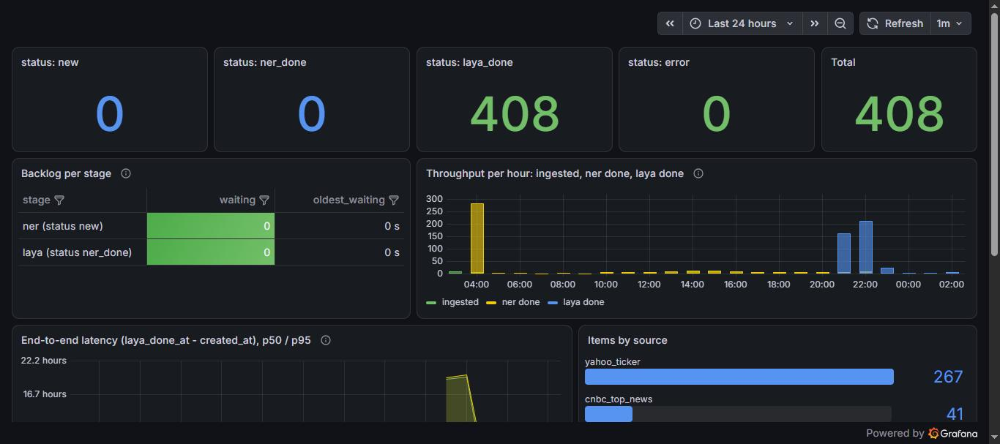
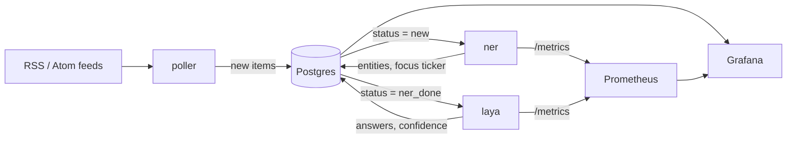

# tickertape

[](https://github.com/avinoamn/tickertape/actions/workflows/ci.yml)
[](LICENSE)

A small, self-hosted pipeline that reads stock-market news feeds, extracts the companies and tickers in each story, and classifies every item with a fine-tuned model. Results are stored in Postgres and shown in Grafana.

It runs on a single-node Kubernetes (k3s) home server, on CPU only: Postgres, three Python services, and Prometheus/Grafana. It is a learning project and a showcase of building, evaluating and operating a small ML pipeline end to end. It is **not trading advice**: the `alert` label only means "a human should look at this".



*The Grafana "Pipeline" dashboard: items per processing stage, throughput, backlog and end-to-end latency.*

## What it does

1. **poller** fetches 14 RSS/Atom feeds every 5 minutes (SEC 8-K filings, three CNBC feeds, and one Yahoo Finance headline feed for each of 10 watchlist tickers) and stores new items in Postgres.
2. **ner** finds companies, tickers, people, amounts and percentages with [GLiNER](https://github.com/urchade/GLiNER), and picks a *focus ticker*: the listed company the story is about.
3. **laya** answers three questions per item with a [Laya](https://github.com/NandhaKishorM/laya) model that was fine-tuned for this task: the event type (earnings, guidance, M&A, analyst, legal, other), the sentiment (positive, neutral, negative) and the action (ignore, log, alert), each with a confidence.
4. **Grafana** shows ingest health, model throughput and latency, answer distributions and confidence, using Postgres and Prometheus.



Postgres is the queue, the storage and the dashboard source: each stage claims rows with `SELECT ... FOR UPDATE SKIP LOCKED`, so there is no message broker. See [docs/architecture.md](docs/architecture.md) for the design and the reasons behind it.

## How well does the model work?

The fine-tuned Laya model was compared with the base model and with a "prior" baseline (always predict the training label distribution) on 150 held-out items:

| Question | Accuracy: fine-tuned | base | prior | Brier score (lower is better): fine-tuned | base | prior |
|---|---|---|---|---|---|---|
| event type | **0.89** | 0.27 | 0.74 | **0.076** | 0.929 | 0.339 |
| sentiment | **0.74** | 0.70 | 0.47 | **0.128** | 0.278 | 0.380 |
| action | **0.80** | 0.25 | 0.59 | **0.082** | 0.496 | 0.204 |

**Read these numbers with care.** The labels, for both training and evaluation, were written by an LLM (Claude Code), not by humans, so the table measures agreement with those labels, not ground truth. The sentiment accuracy gain over the base model is not statistically significant, rare event types (M&A, legal, analyst) are still weak, and the model effectively never predicts `alert`. The full report, with confidence intervals and per-class results, is in [`training/reports/laya_eval.md`](training/reports/laya_eval.md); the method is in [docs/model.md](docs/model.md).

The fine-tuned weights are in a private Hugging Face repository, so a fresh clone runs the public base model (`convaiinnovations/laya`) by default.

## Quickstart (local, Docker)

You need Docker (with Compose), `make` and a POSIX shell (Git Bash on Windows). The first start of `ner` and `laya` downloads their models (about 1 GB and 0.8 GB), and Docker needs at least 4 GB of memory to run both models.

```sh
git clone https://github.com/avinoamn/tickertape.git && cd tickertape

make dev-up                                   # Postgres with the schema applied
SEC_USER_AGENT="Your Name you@example.com" make dev-poll   # fetch the feeds once

docker compose up -d --build ner              # NER worker; UI at http://localhost:7860
docker compose up -d --build laya             # decision worker; UI at http://localhost:7861
docker compose --profile monitoring up -d     # optional: Grafana at http://localhost:3000
```

The SEC requires a descriptive `User-Agent` with a real contact (name and email) for its EDGAR feeds, so use your own. Then look at the data:

```sh
docker compose exec db psql -U tickertape -c "select status, count(*) from items group by 1"
```

More in [docs/development.md](docs/development.md).

## Running it on Kubernetes

The `tickertape` namespace is one Helm chart, `charts/tickertape` (Postgres StatefulSet, schema Job, poller CronJob, ner and laya Deployments with their services, ingress and ServiceMonitors). Settings are in its `values.yaml`; Secrets are created separately and referenced by name. Monitoring is a second Helm release (`k8s/monitoring/values.yaml`, kube-prometheus-stack). Step-by-step instructions, including the one-time cluster bootstrap, secrets, rollout and rollback, are in [docs/operations.md](docs/operations.md).

A release is a `vX.Y.Z` git tag: the [release workflow](docs/releasing.md) builds the three images, publishes them to GHCR and attaches the packaged chart to a GitHub Release. Until the first release is published, images are still built locally and imported into k3s, then `make deploy` (a `helm upgrade --install --atomic`). A workflow to start deployments from GitHub over Tailscale is the next planned piece; see the open issues.

## Repository layout

| Path | What is in it |
|---|---|
| `services/poller`, `services/ner`, `services/laya` | The three services, each with its own `Dockerfile` and pinned `requirements.txt` |
| `common/` | Shared code: database helpers (claim and retry logic) and JSON logging |
| `charts/tickertape/` | The Helm chart: Postgres, poller, ner, laya, services, ingress, ServiceMonitors, and the idempotent schema (`files/schema.sql`: `items`, `decisions`, `feed_state`) |
| `k8s/` | Namespace and deploy-identity RBAC (applied once by an admin), and the monitoring Helm values |
| `grafana/` | Dashboard generator (`gen_dashboards.py` is the source of truth), generated JSON, and a checker that runs every panel query |
| `training/` | Dataset building, labelling rubric, fine-tuning script and notebook, evaluation, and reports |
| `scripts/`, `Makefile` | Build, deploy and operations helpers (`make help` lists them) |
| `docs/` | Architecture, development, operations, releasing, model, and decisions |

## Documentation

- [Architecture](docs/architecture.md): components, data model, how each stage works, metrics and dashboards.
- [Development](docs/development.md): local setup, running and testing the services.
- [Operations](docs/operations.md): deploying, secrets, rollback, monitoring, troubleshooting.
- [Releasing](docs/releasing.md): versioning, cutting a release, what the release workflow does.
- [Model](docs/model.md): how the Laya model was labelled, fine-tuned and evaluated, and its limits.
- [Decisions](docs/decisions.md): why things are the way they are.
- [Contributing](CONTRIBUTING.md) and the [changelog](CHANGELOG.md).

## Security notes

The ner and laya UIs have no authentication and Grafana allows anonymous read-only viewing. They are meant for a private network (LAN or a VPN such as Tailscale) and must not be exposed to the internet. No secrets are stored in this repository: the cluster Secrets are created by scripts from environment variables or generated values.

## License

[Apache License 2.0](LICENSE). `training/finetune_laya.py` is adapted from the single-device fine-tuning script of the [laya](https://github.com/NandhaKishorM/laya) project (also Apache-2.0). News headlines and summaries from third-party feeds are not part of this repository and are used only for private evaluation and training.
