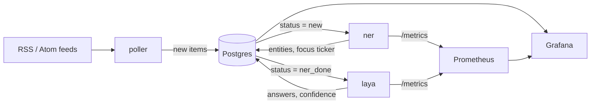

# Architecture

tickertape turns a stream of market-news items into structured, classified records that can be charted. This page explains the pieces and why they fit together the way they do. For the model side (labels, fine-tuning, evaluation) see [model.md](model.md).

## Overview



| Component | Kind | Job |
|---|---|---|
| `poller` | CronJob, every 5 minutes | Fetch feeds, normalise items, insert the new ones |
| `ner` | Deployment, 1 replica | Named-entity recognition and focus-ticker resolution. Worker loop, Gradio UI (port 7860), `/metrics` (port 8000) |
| `laya` | Deployment, 1 replica | Classify each item with three questions. Worker loop, Gradio UI, `/metrics` |
| Postgres 16 | StatefulSet, 5 Gi volume | Queue, storage, and dashboard data source |
| Prometheus + Grafana | Helm release `kps` (kube-prometheus-stack) in namespace `monitoring` | Metrics, four dashboards |

The workloads run in the Kubernetes namespace `tickertape`, monitoring in `monitoring`.

## Postgres as the queue

There is no message broker. Every item is a row in `items` with a `status`:

```
new  ──ner──►  ner_done  ──laya──►  laya_done          (error after 3 failed attempts)
```

A worker claims a batch with `SELECT ... WHERE status = %s ORDER BY created_at, id LIMIT n FOR UPDATE SKIP LOCKED` inside a transaction, processes it, writes the result and the next status, and commits. Consequences:

- If a worker crashes mid-batch, the transaction rolls back and the rows are claimed again, so nothing is lost or half-written.
- Several workers could run side by side without double-processing (`SKIP LOCKED`), though one replica per stage is enough at this volume.
- Backlog per stage is a plain SQL count, which is exactly what the dashboards chart.

**Retry rule** (`common/db.py`): when processing an item raises, `attempts` goes up by one and the item is retried; at 3 attempts it becomes `status = 'error'` with the message in `error`. A stage resets `attempts` when it succeeds, so each stage gets its own 3 tries.

Batch sizes: ner claims 16 rows at a time, laya claims 4 (inference takes seconds per item, so small claims keep row locks short). Both sleep 5 seconds when there is nothing to do.

## Data model (`charts/tickertape/files/schema.sql`)

The schema is idempotent (`IF NOT EXISTS` everywhere) and is applied by a Helm hook Job after every install and upgrade. The file lives in the chart so Helm can ship it; docker-compose mounts the same file for local development.

- **`items`**: one row per news item. `uid` is `sha256(guid or link)` and is unique, which is what makes polling idempotent (`INSERT ... ON CONFLICT (uid) DO NOTHING`). Also: source, title, summary (HTML stripped, about 1,000 characters), link, `published_at`, `status`, `attempts`, `error`, NER output (`entities` as JSON by label, `focus_ticker`, `ner_spans`), the raw Laya answers (`decisions`), and timestamps and durations for each stage.
- **`decisions`**: Laya's answers flattened to one row per item and question (`answer`, `confidence`, `model_rev`), so Grafana can use plain SQL. The primary key is `(item_id, question)` and writes are upserts, so re-running an item with a newer model overwrites the old answers. `model_rev` records which model produced them.
- **`feed_state`**: ETag and Last-Modified per feed for conditional requests.

`items.ner_spans` stores every GLiNER span down to score 0.3 while `entities` uses a 0.5 threshold, so the threshold can be tuned offline without re-running the model.

## poller

A short-lived CronJob (`*/5 * * * *`, no overlapping runs). It reads `services/poller/feeds.yaml`:

- a watchlist of ten tickers (NVDA, AAPL, MSFT, AMZN, TSLA, META, GOOGL, AMD, JPM, XOM),
- SEC 8-K filings (Atom), three CNBC feeds (Earnings, Top News, Finance), and a Yahoo Finance headline feed expanded once per watchlist ticker. A GlobeNewswire feed is present but disabled because the site blocks automated requests.

For each feed it makes a conditional GET when the server supports it, parses the items with `feedparser`, strips HTML, truncates the summary and inserts new rows. SEC requests carry a `User-Agent` with a contact (`SEC_USER_AGENT`, required by the SEC) and stay under its rate limit. A single failing feed is logged and skipped; the job fails only if every feed failed. The poller is not scraped by Prometheus (it lives for seconds), so its dashboard uses Postgres plus kube-state-metrics for job health.

## ner

Model: GLiNER (`urchade/gliner_medium-v2.1`), loaded once at start. It extracts company, ticker, person, money, percent and financial-metric entities from `title + ". " + summary` (threshold 0.5, deduplicated per label).

Then it picks the **focus ticker**, the one listed company the story is about:

1. The first extracted ticker that is in the watchlist.
2. Otherwise, map an extracted company name to a ticker with the SEC's `company_tickers.json` (normalised exact match, with a unique-prefix rule so "Costco" finds "Costco Wholesale"). The file is fetched at start with a baked-in snapshot as a fallback.
3. Otherwise `NULL`.

Extracted tickers are kept only if they are real symbols in the SEC list, and money and percent entities must contain a digit; both rules came from measuring the output against a labelled sample (see [model.md](model.md#ner-evaluation)). The UI lets you try the model on any text.

## laya

Laya is a small model (ModernBERT-based) that answers typed questions about a "state". For each `ner_done` item it gets the source, headline, summary (first 600 characters), focus ticker and entities, and answers three multiple-choice questions defined in `services/laya/questions.py`:

| Question | Options |
|---|---|
| `event_type` | earnings, guidance, mna, analyst, legal, other |
| `sentiment` | pos, neu, neg |
| `action` | ignore, log, alert (alert means "a human should look now") |

Each answer comes with a probability per option; the stored `confidence` is the probability of the chosen option (Laya's calibration is already applied to it). The worker predicts one item at a time (batching was slower here and gave identical answers). Items without a focus ticker still run, because macro news can be relevant too. The model is chosen with `LAYA_MODEL` and pinned with `LAYA_REVISION`. The UI shows the answers and lets you edit the state and the questions.

## Metrics and dashboards

ner and laya expose Prometheus metrics on port 8000: `*_items_processed_total`, `*_errors_total`, `*_inference_seconds` and `*_batch_size` histograms, plus `ner_entities_total{label}`, `laya_answers_total{question,answer}` and `laya_confidence{question}`. Each processed item also writes one JSON log line (`ts, svc, item_id, status, ms, error`).

Four Grafana dashboards are generated from `grafana/gen_dashboards.py` (the source of truth) into `grafana/dashboards/*.json` and loaded through labelled ConfigMaps:

- **Poller**: items ingested per hour and source, feed freshness and ingest lag, data quality, job health (from kube-state-metrics), latest items.
- **NER**: throughput, latency percentiles, errors, entities by label, share of items with a focus ticker.
- **Laya**: throughput, latency, memory and CPU, answer distribution per question and model revision, confidence histograms, share of low-confidence answers, the `alert` items.
- **Pipeline**: items per status, backlog per stage, end-to-end latency, items per source, error rows.

`grafana/verify_dashboards.py` runs every panel query through Grafana's query API and reports errors and empty panels.

## Kubernetes layout

Everything below is one Helm chart (`charts/tickertape`, see [operations.md](operations.md#the-helm-chart)), except the namespace, RBAC and Secrets and the monitoring stack.

- Postgres: StatefulSet with a 5 Gi `local-path` volume and a Secret for credentials.
- ner and laya: one replica each, strategy `Recreate` (they each own a ReadWriteOnce volume that caches the Hugging Face models, so two pods must never run at once). Memory limits 2 Gi (ner) and 3.5 Gi (laya); laya is also limited to 2 CPU cores with `OMP_NUM_THREADS=MKL_NUM_THREADS=2`, because uncapped it starved the rest of a 4-core node. Readiness probes use `/metrics`, which only starts after the model has loaded.
- Services: a ClusterIP Service per workload carries the ports (UI 7860, metrics 8000); every UI also gets its own NodePort Service so it opens from any device on the private network (ner 30002, laya 30003, Grafana 30004). Traefik Ingresses (`ner.local`, `laya.local`, `grafana.local`) are an extra.
- Deploy identity: a namespace-scoped `deployer` ServiceAccount (`k8s/rbac.yaml`) that can manage workloads in `tickertape` and nothing else.
- Backups: a daily `pg_dump` CronJob into its own volume (newest 14 kept) and a weekly CronJob that restores the newest dump into a scratch database, fails if backups are stale, and proves the restore works.
- Monitoring: kube-prometheus-stack in `monitoring`, trimmed to what the dashboards use so 365 days of history fit in a small volume; ServiceMonitors for ner and laya; Grafana reads Postgres through a read-only role.

## Known limits

- One node, one replica per stage, no high availability. Postgres is the only irreplaceable data: a daily dump and a weekly restore test run in the cluster, but they live on the same node, so a copy has to be pulled off it (see [operations.md](operations.md#backups)).
- The UIs have no authentication. Run them on a private network only.
- CPU-only inference: about 0.7 s per item for ner and 17 s per item for laya on the 4-core Celeron node, so laya can process roughly 200 items per hour, enough for these feeds but a bottleneck in a news burst (the backlog panel shows it).
